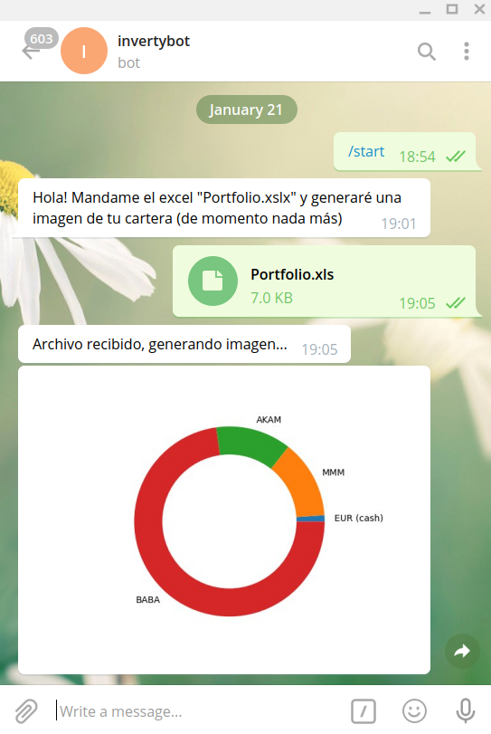
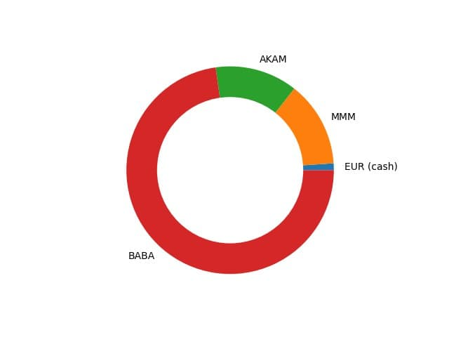

# invertybot

## A simple bot to generate a pie chart from a Degiro report (in Excel format)

It convert this:

| Producto                               | Symbol/ISIN   |	Cantidad |	Precio de  |	Valor local |	Valor en EUR |
|----------------------------------------|---------------|-----------|-------------|----------------|----------------|
| CASH & CASH FUND & FTX CASH (EUR)	     |               |           |             |     EUR 60.58  |	 60,58       |
| 3M COMPANY COMMON STOC                 |	US88579Y1010 |	2        |	155,33     |	 USD 310.66 |	 265,15      |
| AKAMAI TECHNOLOGIES I	                 |  US00971T1016 |	3	     |  111,99	   |     USD 335.97	|    286,75      |
| ALIBABA GROUP HOLDING	                 |  US01609W1027 |	4        |	249,05     |	 USD 996.20	|    850,26      |

Into this:

